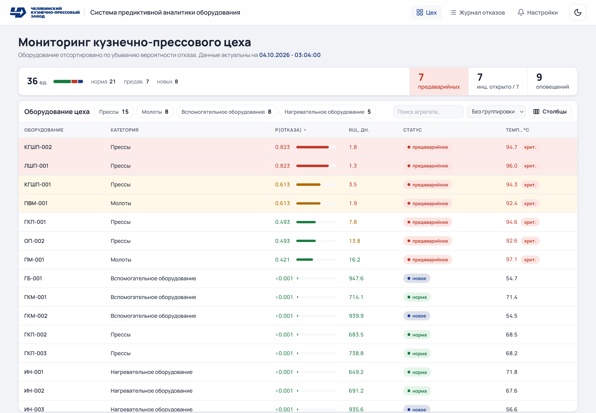
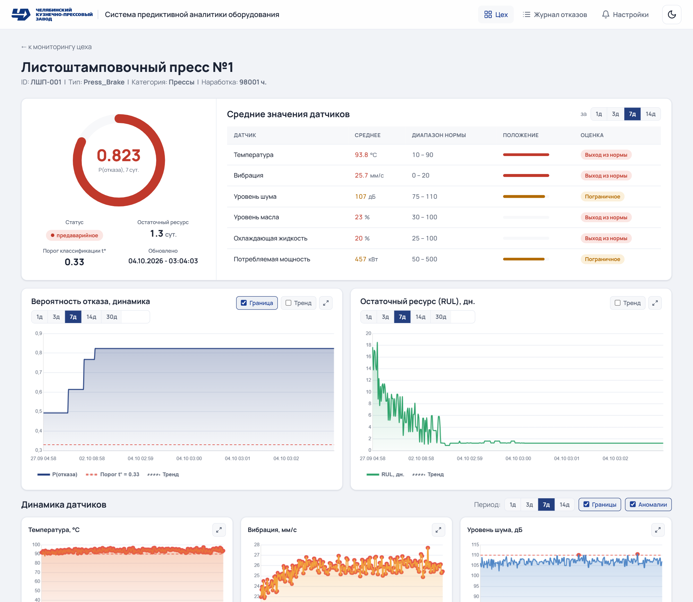
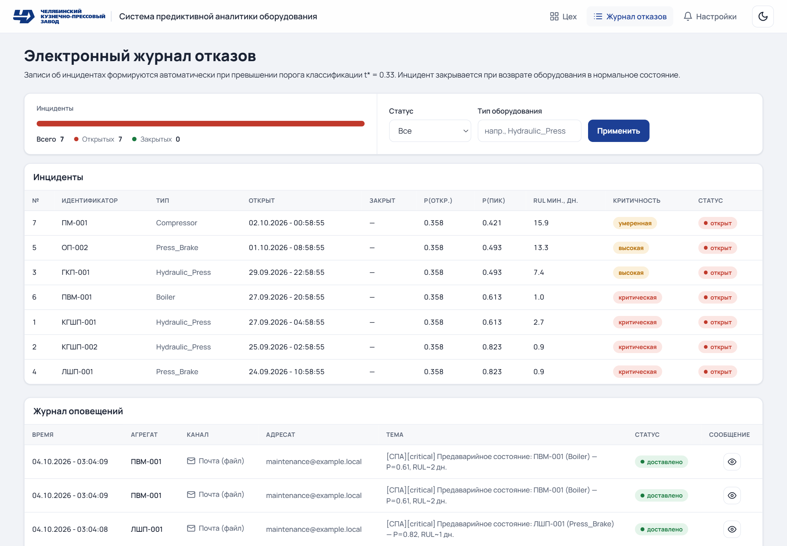
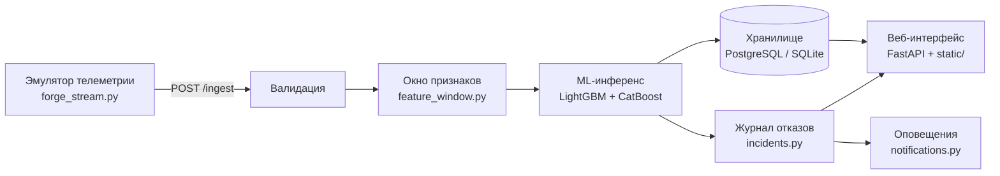

# СПА — система предиктивной аналитики промышленного оборудования (production)

[](https://github.com/VoronMain/Predictive-Maintenance-Service---Production/actions/workflows/ci.yml)
[](LICENSE)


Монолитное веб-приложение на FastAPI: мониторинг технического состояния
30 агрегатов кузнечно-прессового цеха. Принимает поток телеметрии, прогоняет
через ML-модель (LightGBM — вероятность отказа, CatBoost — остаточный ресурс),
ведёт журнал отказов и рассылает оповещения.

Это **production-сборка**: только то, что уезжает в облако. Разработка,
документация, тесты и обучение моделей ведутся отдельно.



<table>
  <tr>
    <td width="50%"></td>
    <td width="50%"></td>
  </tr>
  <tr>
    <td align="center">Карточка агрегата</td>
    <td align="center">Журнал отказов</td>
  </tr>
</table>

## Как это работает



Конвейер (`app/pipeline.py`) проходит шаги: приём измерений, валидация, окно
признаков, инференс, сохранение, детектирование инцидентов и оповещения.

## Стек

| Область | Технологии |
|---------|------------|
| Сервер | Python 3.13, FastAPI, Uvicorn, Pydantic |
| ML | LightGBM (вероятность отказа), CatBoost (остаточный ресурс), scikit-learn, pandas, NumPy |
| Хранилище | PostgreSQL (psycopg 3), SQLite как резервный бэкенд |
| Интерфейс | HTML, CSS и JavaScript без сборки, Chart.js для графиков |
| Тесты и CI | pytest, testcontainers, GitHub Actions |
| Развёртывание | Docker, Render (Blueprint `render.yaml`) |

## Состав

| Каталог / файл | Назначение |
|----------------|------------|
| `app/` | приложение: конвейер (`pipeline.py`), инференс (`ml_service.py`), хранилище (`db_base.py` + `database.py` + `pg_database.py`), журнал отказов (`incidents.py`), оповещения (`notifications.py`), веб-интерфейс (`static/`) |
| `emulator/forge_stream.py` | эмулятор потока телеметрии: генерирует измерения 30 агрегатов и шлёт в `/ingest` |
| `predictive_maintenance/` | пакет инференса с артефактами обученных моделей |
| `run.py` | локальный запуск: HTTP-сервер + эмулятор в одном сеансе |
| `.env.example` | список переменных окружения |
| `requirements.txt` | зависимости рантайма |
| `requirements-dev.txt` | зависимости для запуска тестов (`pytest`, `httpx`) |
| `tests/` | тесты HTTP-интерфейса и инференса |

## Локальный запуск

```bash
python -m venv .venv && . .venv/Scripts/activate   # Windows: .venv\Scripts\activate
pip install -r requirements.txt
cp .env.example .env        # при необходимости отредактировать
python run.py               # сервер на http://127.0.0.1:8000 + эмулятор
```

По умолчанию бэкенд хранения — SQLite (`data/spa.db`). Для PostgreSQL задать
`SPA_DB_BACKEND=postgres` и параметры `SPA_PG_*` в `.env`.

## Тесты

```bash
pip install -r requirements-dev.txt
pytest
```

Тесты прогоняются автоматически на каждый PR и push в `main`
(`.github/workflows/ci.yml`), там же собирается контрольный Docker-образ.

## Веб-интерфейс

| Страница | Что показывает |
|----------|----------------|
| `/` | обзор цеха: карточки агрегатов с вероятностью отказа, остаточным ресурсом и статусом |
| `/machine/{id}` | карточка агрегата: динамика прогноза, средние по датчикам, история инцидентов |
| `/incidents-ui` | журнал отказов |
| `/settings` | настройки оповещений |
| `/docs` | Swagger UI |

`/health` — единственный эндпоинт без авторизации (проверка платформой).

## Живой стенд

https://predictive-maintenance-service-5zvs.onrender.com/

Стенд закрыт HTTP Basic: открыт только `/health`, всё остальное — включая
`/docs` — требует пароль. Учётные данные выдаёт автор проекта, в репозитории
они не хранятся.

## Развёртывание

Стенд развёрнут на [Render](https://render.com). Приложение собирается в один
Docker-образ (`Dockerfile`): лончер `start.py` поднимает в контейнере
HTTP-сервис и эмулятор потока телеметрии. Порт лончер берёт из переменной
`PORT`, которую выставляет Render.

Параметры сервиса описаны в Blueprint `render.yaml`: сборка по `Dockerfile`,
healthcheck `/health` (единственный путь без авторизации) и список
переменных окружения. Значения секретов (параметры подключения к базе,
логин и пароль HTTP Basic) в репозитории не хранятся — Render запрашивает их
при создании Blueprint и хранит в дашборде. Упавший процесс лончер
завершает с ненулевым кодом, и Render перезапускает сервис.

Хранилище стенда — managed-PostgreSQL, без расширения TimescaleDB. Приложение
это переживает: гипертаблицы и политики ретенции не создаются, таблицы
временных рядов остаются обычными, а в лог при старте идёт предупреждение.

Ограничения стенда:

- На плане Render, который усыпляет сервис при простое, вместе с ним
  останавливается эмулятор телеметрии: поток данных прерывается до
  следующего запроса, разбудившего сервис.
- Данные в базе стенда зависят от того, переносились ли они со старого стенда
  или база засеяна заново; после смены логики признаков или модели
  вероятности на стенде могут не совпадать с локальными, пока база не
  пересеяна. <!-- TODO: уточнить у автора -->

Постановка задачи и разбор решений —
[issue #1](https://github.com/VoronMain/Predictive-Maintenance-Service---Production/issues/1).
